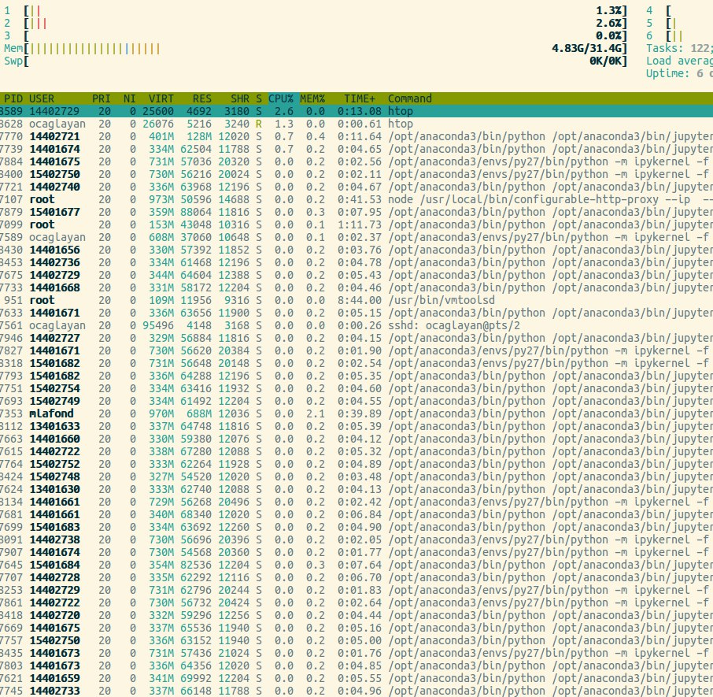

# JupyterHub Installation Guide

This document explains all the steps for a working JupyterHub installation on Ubuntu 16.04 LTS. The machine used for this purpose is a Virtual Machine on VMWare ESX server in our university. The VM has 6 CPU's, 32GB of RAM and 100GB of disk space partitioned into 25GB `rootfs` and 75GB `/home` folder.

After installing Ubuntu 16.04 LTS x86_64, here's what we did to create a fully working JupyterHub server. All the steps below are also available through a set `bash` scripts in this repository's `setup` [folder](./setup).

## Installing system dependencies

[setup/00-sysdeps.sh](./setup/00-sysdeps.sh)

The following packages are needed in order for the JupyterHub and their components to work flawlessly. `pandoc` and `texlive-*` packages are necessary for saving a Jupyter notebook as PDF. We also installed `octave` as we'll provide an `octave` kernel for the users besides Python.
```
# apt install libsm6 libxrender1 libfontconfig1 build-essential gcc-multilib
# apt install npm nodejs-legacy octave
# apt install pandoc dvipng
# apt install texlive-latex-base dvipng texlive-latex-recommended \
              texlive-fonts-recommended cm-super texlive-latex-extra

# npm install -g configurable-http-proxy
```

Normally we should be fine with the above packages but if you have something to add, feel free to send a pull request!

**Some additional stuff**

We didn't want to clutter each login and also JupyterHub's log files with Ubuntu MOTD messages so we removed them all:
```
# rm /etc/update-motd.d/*
```

Also, to prepare for batched user account creation, let's create an empty `notebooks` folder in `/etc/skel`:
```
mkdir -p /etc/skel/notebooks
```

## Installation of Anaconda

We decided to use the Anaconda distribution for Python to ease management of the Python ecosystem. Go [download](https://www.continuum.io/downloads) the latest Anaconda Python 3 installer from  and install it under `/opt/anaconda3`. Change `PATH` globally so that every user starts to use the new anaconda distribution for their default Python environment:
```
# echo 'export PATH=/opt/anaconda3/bin:$PATH' > /etc/profile.d/anaconda.sh
```

Since JupyterHub requires a Python >= 3.3, we're using Python 3.x as our default Anaconda environment. Note that this won't prevent us from serving Python 2.x notebooks to users.

Next let's create a Python 2.7 environment and install anaconda distribution to that environment as well:
```
# conda create --name py27 python=2.7
# conda install -n py27 anaconda
```

Now when you logout and login back, your shell will default to the python3 environment:
```
# python
Python 3.5.1 |Anaconda 4.0.0 (64-bit)| (default, Dec  7 2015, 11:16:01) 
...
```

At any time you can switch to the 2.7 environment called `py27` with the following command:
```
# source activate py27
# python
Python 2.7.11 |Anaconda 4.0.0 (64-bit)| (default, Dec  6 2015, 18:08:32) 
...
```

Finally for going back to the default Python 3 environment, you can type `source deactivate`.

## Installation of JupyterHub and the kernels

[setup/01-jupyterinst.sh](./setup/01-jupyterinst.sh)

Now we can proceed with the installation of Jupyter packages. First let's install JupyterHub and Jupyter kernels for `bash` and `octave`. Please be sure that you are in the default Python 3.x environment before proceeding the following steps:
```
# pip install jupyterhub
# pip install bash_kernel octave_kernel
# python -m bash_kernel.install
# python -m octave_kernel.install
```

We also need to install python 2.7 kernel for serving Python 2 notebooks. For this, let's first switch to our Python 2.x conda environment then install the kernel:
```
# source activate py27
# ipython kernel install
```

### Installing R Kernel

Adding support for R kernels requires a little bit more work. First add official R repositories to Ubuntu by following the steps [here](https://cran.r-project.org/bin/linux/ubuntu/README). After updating your repository index with `apt-get upgrade` install the following packages:
```
apt-get install r-base r-base-dev libzmq3-dev
```

We'll then launch an R interpreter and finally type the following commands to install the necessary R packages and the Jupyter kernel:
```
> install.packages(c('rzmq','repr','IRkernel','IRdisplay'),
                 repos = c('http://irkernel.github.io/', getOption('repos')))
...
...
> IRkernel::installspec(user = FALSE)
[InstallKernelSpec] Installed kernelspec ir in /usr/local/share/jupyter/kernels/ir
```

## Testing the bare minimum

You may want to try if everything went smoothly by running the JupyterHub with default configuration:
```
# jupyterhub --no-ssl
```

Now visit `http://<ip address>:8000` and login with your UNIX credentials. Check whether the **New** menu contains `bash`, `octave`, `Python 2` and `Python 3`. Create some notebooks, execute cells to catch possible problems.

## Users and Groups

[setup/02-users.sh](./setup/02-users.sh)

You can write down your lecturers and students into the files `lecturers.list` and `students.list` in `setup/`. You can also add some of the users to the `admins.list` to limit SSH access only to those users. The users in `admins.list` will also be set as admin users for JupyterHub. Here's the script that manages all of this:

```bash
#!/bin/bash

# Add lecturers group
addgroup lecturers

# Add lecturer users
while IFS=, read NAME PW; do
    echo "Creating lecturer $NAME"
    if [ -z $PW ]; then
        useradd -s "/bin/bash" -m -N -g users -G sudo,adm,lecturers $NAME
    else
        useradd -s "/bin/bash" -m -N -g users -G sudo,adm,lecturers -p "$PW" $NAME
    fi
done < <(egrep -v '^#' lecturers.list)

# Add some admin users, add them to SSHD allowed list
ADMINS=`tr "\n" " " < admins.list`
echo "Administrators with SSH access: $ADMINS"
echo "AllowUsers $ADMINS" >> /etc/ssh/sshd_config
systemctl reload ssh.service

# Add regular users
while IFS=, read NAME PW; do
    echo "Creating student $NAME"
    if [ -z $PW ]; then
        useradd -s "/bin/bash" -m -N -g users $NAME
    else
        useradd -s "/bin/bash" -m -N -g users -p "$PW" $NAME
    fi
done < <(egrep -v '^#' students.list)

# Create fontconfig-cache so that the first execution of cells
# don't take time with some ugly warning messages.
echo "Creating fontconfig cache in HOME folders..."
for u in $(ls /home/); do
  sudo -H -u $u fc-cache
done
```

## JupyterHub configuration

[setup/03-jupyterconf.sh](./setup/03-jupyterconf.sh)

 - Note that since our server will only be used for educational purposes and will not be accessible from outside of the university, I choosed to go with plain HTTP which is normally **not recommended**. For supporting HTTPS, please [check here](https://jupyterhub.readthedocs.io/en/latest/getting-started.html#ssl-encryption).
 - Copy over your custom logo to `setup/data/logo.png` if you'd like to customize the logo of JupyterHub.
 - If you'd like to enable `cull_idle_servers` script you need to decide an admin user to generate a token for. Look at the   `TODO` item below.

```bash
#!/bin/bash

# Set the files and the folders
CONFDIR="/etc/jupyterhub"
SERVDIR="/srv/jupyterhub"
LOGFILE="/var/log/jupyterhub.log"
CONFFILE=${CONFDIR}/jupyterhub.py

# Create the folders
mkdir -p $CONFDIR ${SERVDIR}/ssl &> /dev/null

# Set permissions
chmod 700 $CONFDIR $SERVDIR

# Create default configuration
jupyterhub --generate-config -f $CONFFILE

# Generate cookie secret
openssl rand -base64 2048 > ${SERVDIR}/cookie_secret

# Generate proxy auth token
PROXY_TOKEN=`openssl rand -hex 32`

# Copy over logo
cp data/logo.png ${SERVDIR}

# Get admin users
ADMINS=`python -c 'print(set(open("admins.list").read().strip().split("\n")))'`

# Setup configuration
echo "c.JupyterHub.proxy_auth_token = '$PROXY_TOKEN'" >> $CONFFILE
echo "c.JupyterHub.cookie_secret_file = '${SERVDIR}/cookie_secret'" >> $CONFFILE
echo "c.JupyterHub.cookie_max_age_days = 1" >> $CONFFILE
echo "c.JupyterHub.db_url = '${SERVDIR}/jupyterhub.sqlite'" >> $CONFFILE
echo "c.JupyterHub.extra_log_file = '${LOGFILE}'" >> $CONFFILE
echo "c.JupyterHub.logo_file = '${SERVDIR}/logo.png'" >> $CONFFILE
echo "c.Spawner.notebook_dir = '~/notebooks'" >> $CONFFILE
echo "c.Authenticator.admin_users = $ADMINS" >> $CONFFILE

# Restrict permissions
chmod 600 ${CONFDIR}/*
chmod 600 ${SERVDIR}/*

# Install systemd services
cp data/jupyterhub.service /etc/systemd/system
systemctl daemon-reload
systemctl enable jupyterhub.service jupyterhub-idle-killer.service

# Optional: Install cull_idle_servers
wget http://raw.githubusercontent.com/jupyterhub/jupyterhub/master/examples/cull-idle/cull_idle_servers.py \
    -O ${SERVDIR}/cull-idle-servers
chmod +x ${SERVDIR}/cull-idle-servers

# Copy systemd file
cp data/jupyterhub-idle-killer.service /etc/systemd/system

# Generate API token
API_TOKEN=`openssl rand -hex 32`

# TODO: Pick an admin user here for the cull service
API_USER="lect1"

echo "c.JupyterHub.api_tokens = {'${API_TOKEN}' : '${API_USER}'}" >> $CONFFILE
sed -i "s/%%APITOKEN%%/${API_TOKEN}/" /etc/systemd/system/jupyterhub-idle-killer.service

systemctl enable jupyterhub-idle-killer.service
```

## Result

If everything goes well, you can start the systemd services to let the journey begin!
```
# systemctl start jupyterhub.service
# systemctl start jupyterhub-idle-killer.service
```

Here's a screenshot of resource utilization during a first year mathematics class with ~40 students:


